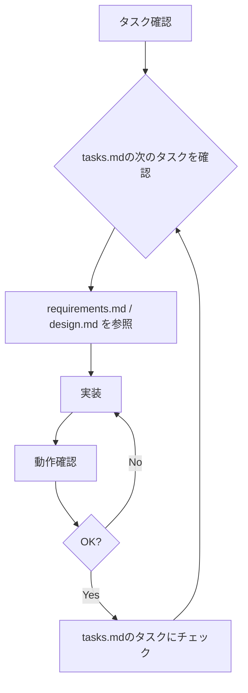

# エージェント指示書（AGENTS.md）

> 固定順デッキ型TCG ブラウザプロトタイプ — AI開発エージェント向け指示
> 世界観：星典×星霊（暫定）

---

## 1. プロジェクト概要

本プロジェクトは、**固定順デッキ型TCG**のブラウザプロトタイプを実装するものである。
「金色のガッシュベル!! THE CARD BATTLE」の固定順デッキメカニクスを**インスピレーション**とし、
独自の世界観「**星典×星霊**」と独自システム「**共鳴・過詠**」を加えた
オリジナルカードゲームをバニラHTML/CSS/JSで構築する。

### ゲームの核心コンセプト
> **星典 = デッキ = ライフ** の三位一体設計
> - 星典を詠めばSP（リソース）を得られる
> - しかし星典が尽きれば敗北する
> - 「今詠むか、温存するか」の判断が常に勝敗を左右する

### 独自システム
> - **共鳴（レゾナンス）**：星霊×星術の属性一致でボーナス
> - **過詠（オーバーチャージ）**：追加SPで術を強化するリスク/リターン

---

## 2. 目的

この仕様に基づき、**ブラウザで動作するゲームを実装すること**。
最終目標は以下の通り：

> **CPUと1試合を最後までバグなくプレイできるブラウザゲーム**
> - 星力衝突による攻撃/防御の読み合いが機能する
> - 星護システムによるダメージ選択が機能する
> - 星典の詠みジレンマが体験できる
> - 共鳴・過詠による戦略の幅がある

---

## 3. 関連ドキュメント

| ドキュメント | パス | 内容 |
|-------------|------|------|
| 統合仕様書 | `fixed_deck_tcg_unified_spec.md` | 企画・仕様の原本 |
| 要件定義書 | `requirements.md` | 機能要件・非機能要件（独自システム含む） |
| 設計書 | `design.md` | アーキテクチャ・データモデル・モジュール設計 |
| タスク一覧 | `tasks.md` | 実装タスク・見積・依存関係 |

**作業前に必ず `requirements.md` と `design.md` を確認すること。**

---

## 4. 開発方針

### 4.1 MVP最優先
- 動くものを先に作る
- 完璧さより実動を優先
- 拡張性は考慮するが、過剰な抽象化はしない

### 4.2 段階的実装
- `tasks.md` のPhase順に実装する
- Phase 1 → Phase 2 → Phase 3/4（並行可） → Phase 5
- 各Phaseの完了条件を満たしてから次に進む

### 4.3 コード品質
- 各関数は**単一責務**に従う
- ロジック（`game.js`, `battle.js` 等）は**DOMに依存しない**
- UI（`ui.js`）のみがDOM操作を行う
- 変数・関数名は意味のある英語名

---

## 5. 技術仕様

### 5.1 使用技術
- HTML5
- CSS3（バニラCSS）
- JavaScript（ES6+、モジュール不使用、`<script>` タグ読み込み）

### 5.2 禁止事項
- ❌ 外部ライブラリ・フレームワークの使用
- ❌ npm / yarn / ビルドツールの使用
- ❌ TypeScriptの使用
- ❌ CSSフレームワークの使用
- ❌ 不要な抽象化・デザインパターンの適用
- ❌ 過剰なファイル分割

### 5.3 ファイル構成
```
project/
├── index.html          … エントリーポイント
├── css/
│   └── style.css       … 全スタイル
├── js/
│   ├── main.js          … 初期化・エントリー
│   ├── game.js           … ゲームループ・状態管理
│   ├── card.js           … カード定義・データ
│   ├── player.js         … プレイヤー状態管理
│   ├── battle.js         … 戦闘ロジック（星力衝突・共鳴・過詠）
│   ├── cpu.js            … CPU行動ロジック
│   ├── ui.js             … UI描画・DOM操作
│   └── logger.js         … ログ管理
├── requirements.md
├── design.md
├── tasks.md
├── AGENTS.md
└── fixed_deck_tcg_unified_spec.md
```

---

## 6. 核心メカニクスの実装ガイド

### 6.1 星典詠みシステム
```javascript
// ✅ 星典詠みは「リソース獲得 + ライフ消費」の二面性
function readPage(player) {
  if (player.chronicleIndex >= player.chroniclePages.length) return null;
  const card = player.chroniclePages[player.chronicleIndex];
  player.chronicleIndex++;
  player.sp += 2;  // 1ページ = SP+2
  return card;
}
```

### 6.2 星力衝突
```javascript
// ✅ 攻撃側 vs 防御側の星力比較
function resolveClash(attackAstral, attackSpell, overcharge,
                      defenseAstral, defenseSpell, defOvercharge) {
  const atkPower = attackAstral.power + attackSpell.powerBoost
    + getResonanceBonus(attackAstral, attackSpell)
    + calcOverchargePowerBonus(overcharge);

  const defPower = defenseSpell
    ? defenseAstral.power + defenseSpell.powerBoost
      + getResonanceBonus(defenseAstral, defenseSpell)
      + calcOverchargePowerBonus(defOvercharge)
    : 0;  // 守星術なし→防御力0

  return atkPower > defPower;  // 同値は防御側有利
}
```

### 6.3 共鳴（レゾナンス）
```javascript
// ✅ 属性一致で +1 ボーナス
function hasResonance(astral, spell) {
  return astral.element === spell.element;
}

function getResonanceBonus(astral, spell) {
  return hasResonance(astral, spell) ? 1 : 0;
}
```

### 6.4 過詠（オーバーチャージ）
```javascript
// ✅ 追加SPで効果を強化
function getMaxOvercharge(spellCost) {
  return spellCost * 2;  // 上限 = 通常コストの2倍
}

function calcOverchargeDamageBonus(extraSP) {
  return Math.floor(extraSP / 2);  // 追加SP2ごとにダメージ+1
}
```

### 6.5 星護（かばう）システム
```javascript
// ✅ 星霊の状態遷移: 輝態 → 蝕態 → 消星
function guardWithAstral(astral) {
  if (astral.state === 'radiant') {
    astral.state = 'eclipse';
    return 'eclipse';
  } else {
    return 'vanish';  // 消星（除去）
  }
}
```

### 6.6 フェイズ制御
```javascript
// ✅ 各フェイズを明確に管理
// スタートフェイズ: 詠み0〜3回（プレイヤー選択）
// メインフェイズ: カード使用
// バトルフェイズ: 星撃宣言 → 星力衝突 → ダメージ解決
// エンドフェイズ: 整理 + 自動1ページ詠み
```

---

## 7. 実装ルール

### 7.1 コーディング規約
```javascript
// ✅ Good: 明確な関数名、単一責務
function readPage(player) {
  if (!canRead(player)) return null;
  const card = player.chroniclePages[player.chronicleIndex];
  player.chronicleIndex++;
  player.sp += 2;
  updateSkyWindow(player);
  return card;
}

// ❌ Bad: 複数の責務を持つ関数
function doTurn(state) {
  // 詠み、カード使用、バトル、判定を全部やる → 分割すること
}
```

### 7.2 状態管理
- グローバルな `gameState` オブジェクトで全状態を管理
- 状態の変更は専用の関数を通じて行う
- 直接的なプロパティ書き換えは避ける
- バトル中の一時状態は `gameState.currentBattle` で管理

### 7.3 UI更新ルール
- 状態が変わるたびに `renderGameState(state)` を呼ぶ
- DOMの生成は `ui.js` 内に完全に閉じる
- テンプレートリテラルを活用してHTML生成
- フェイズに応じて操作可能なUI要素を制御する

---

## 8. 優先順位（実装の判断基準）

以下の順で重要度が高い。迷った場合はこの優先順位に従うこと。

1. **ゲームが最後までプレイできる** — 試合開始から決着まで
2. **星力衝突が正しく機能する** — 攻撃/防御の判定が正確
3. **星護システムが動作する** — ダメージ選択が機能
4. **勝敗が正しく判定される** — 星典消滅 or 星霊全滅
5. **共鳴システムが動作する** — 属性一致ボーナスが反映
6. **過詠システムが動作する** — 追加SP投入で強化
7. **CPUが動作する** — CPUが攻撃・防御・星護の判断をする
8. **UIが操作可能** — クリックでフェイズが進行できる
9. **見た目が整っている** — 美観は最後

---

## 9. テスト・検証手順

### 9.1 各Phase完了時の確認
| Phase | 確認内容 |
|-------|---------|
| Phase 1 | ファイルがブラウザで読み込め、カードデータ（星霊/星術/星命）がコンソール出力される |
| Phase 2 | コンソール上で星力衝突・共鳴・過詠・星護のシミュレーションが正しく動作 |
| Phase 3 | 画面上で詠み・カード使用・星撃宣言・星護選択・過詠が操作できる |
| Phase 4 | CPUが攻撃/防御/詠み/星護/共鳴活用を自動で判断し、ゲームが進行する |
| Phase 5 | 1試合を最初から最後まで通しプレイできる |

### 9.2 最終完了条件
- [ ] ブラウザでindex.htmlを開くだけで動作する
- [ ] CPUと1試合を完了できる
- [ ] 星力衝突による攻撃/防御が正しく機能する
- [ ] 共鳴によるボーナスが正しく反映される
- [ ] 過詠による強化が正しく機能する
- [ ] 星護システムが正しく動作する
- [ ] 星典の詠みジレンマが体験できる
- [ ] 勝敗が正しく表示される（星典消滅 or 星霊全滅）
- [ ] コンソールにエラーが出ない
- [ ] Chrome / Firefox / Safari で動作する

---

## 10. 作業フロー



### 10.1 実装時の注意事項
1. **必ず `tasks.md` を確認**してから作業を始める
2. **`design.md` のデータモデル・関数設計**に従って実装する
3. **1タスクずつ実装**し、その都度動作確認する
4. **行き詰まった場合は `requirements.md`** に戻って要件を再確認する
5. **判断に迷ったらシンプルな方**を選ぶ

### 10.2 特に注意すべき実装ポイント
- **天窓の管理**：詠んだ位置の直近2ページが使用可能
- **バトルフェイズの対話性**：攻撃→防御のインタラクションが核心
- **CPUの防御リアクション**：プレイヤーの攻撃に対してCPUが守星術を使うかの判断
- **ダメージの二択**：星典で受ける vs 星霊で星護、常にプレイヤーに選択させる
- **共鳴判定**：星霊と星術の属性チェックを忘れずに
- **過詠UI**：追加SP量を直感的に選択できるUIにする

---

## 11. コミュニケーション

### 11.1 進捗報告
- `tasks.md` のチェックボックスを更新して進捗を示す
- 各Phase完了時にサマリーを報告

### 11.2 問題発生時
- 仕様の矛盾を発見した場合 → `requirements.md` を優先
- 技術的な問題 → 最もシンプルな解決策を採用
- 判断がつかない場合 → ユーザーに確認

---

## 12. よくある判断基準

| 状況 | 判断 |
|------|------|
| 機能を豪華にするか最小にするか | **最小**（MVP優先） |
| 美観にこだわるかロジック優先か | **ロジック優先** |
| 汎用的に作るか専用に作るか | **専用**（後で汎用化） |
| ライブラリを使うかバニラか | **バニラ**（外部依存禁止） |
| 完璧に作るかとりあえず動くものか | **とりあえず動くもの** |
| バトルの演出にこだわるかロジック正確性か | **ロジック正確性** |
| 原作完全再現かオリジナルか | **オリジナル**（独自システム優先） |

---

## 13. 用語対応表

| 概念 | ゲーム内用語 | コード変数名 |
|------|-------------|-------------|
| デッキ/ライフ | 星典 | chronicle |
| リソース | 星力（SP） | sp |
| 戦闘ユニット | 星霊 | astral |
| 攻撃カード | 攻星術 | spell (timing: 'attack') |
| 防御カード | 守星術 | spell (timing: 'defense') |
| サポート | 星命 | fate |
| 戦闘判定 | 星力衝突 | clash |
| かばう | 星護 | guard |
| 通常状態 | 輝態 | radiant |
| 負傷状態 | 蝕態 | eclipse |
| 除去 | 消星 | vanish |
| 見開き | 天窓 | skyWindow |
| 戦闘開始 | 星撃宣言 | starStrike |
| 属性コンボ | 共鳴 | resonance |
| 追加コスト強化 | 過詠 | overcharge |
