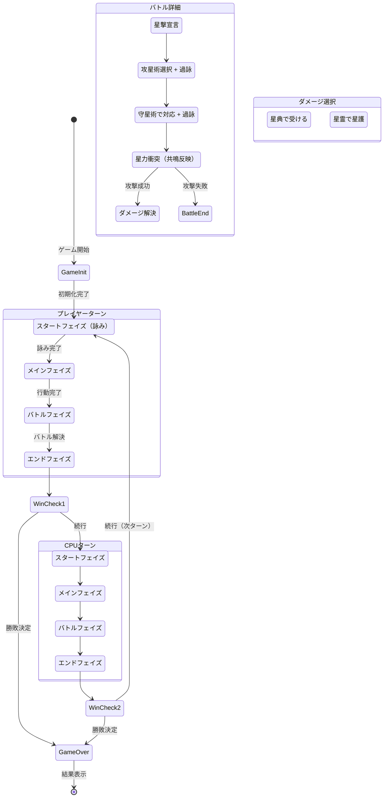

# 設計書（Design）

> 固定順デッキ型TCG ブラウザプロトタイプ
> 世界観：星典×星霊（暫定）

---

## 1. アーキテクチャ概要

### 1.1 全体構成
```
project/
├── index.html         … エントリーポイント
├── css/
│   └── style.css      … スタイル定義
└── js/
    ├── main.js         … エントリー・初期化
    ├── game.js          … ゲームループ・状態管理
    ├── card.js          … カード定義・データ
    ├── player.js        … プレイヤー/CPU状態管理
    ├── battle.js        … 戦闘ロジック（星力衝突・共鳴・過詠）
    ├── cpu.js           … CPU行動ロジック
    ├── ui.js            … UI描画・DOM操作
    └── logger.js        … ログ管理
```

### 1.2 設計原則
- **ロジックとUIの分離**：ゲームロジックはDOMに依存しない
- **単一責務**：各モジュールは1つの責務のみ担当
- **シンプルさ優先**：不要な抽象化・過剰設計の禁止
- **外部依存ゼロ**：バニラHTML/CSS/JSのみ

### 1.3 データフロー
```
ユーザー入力（click）
    ↓
  ui.js（イベントハンドリング）
    ↓
  game.js（状態遷移・フェイズ制御）
    ↓
  battle.js / player.js（ロジック処理）
    ↓
  game.js（状態更新）
    ↓
  ui.js（画面再描画）
```

---

## 2. データモデル設計

### 2.1 属性（Element）
```javascript
/**
 * 属性定義（共鳴システム用）
 * @typedef {'fire'|'water'|'wind'|'earth'} Element
 */
const ELEMENTS = ['fire', 'water', 'wind', 'earth'];
```

### 2.2 Card（基底）
```javascript
/**
 * @typedef {Object} Card
 * @property {string}   id      - 一意識別子（例: "astral_001"）
 * @property {string}   name    - カード名
 * @property {'astral'|'spell'|'fate'} type - カード種別
 * @property {number}   cost    - SP消費コスト
 * @property {Element}  [element] - 属性（共鳴システム用）
 */
```

### 2.3 AstralCard（星霊カード）
```javascript
/**
 * @typedef {Object} AstralCard
 * @extends Card
 * @property {'astral'}  type     - 'astral'
 * @property {number}    power    - 星力値（星力衝突で使用）
 * @property {Element}   element  - 属性
 * @property {'radiant'|'eclipse'} state - 状態（輝態/蝕態）
 */
```

### 2.4 SpellCard（星術カード）
```javascript
/**
 * @typedef {Object} SpellCard
 * @extends Card
 * @property {'spell'}     type       - 'spell'
 * @property {'attack'|'defense'} timing - 攻星術 or 守星術
 * @property {number}      powerBoost - 星力上昇値（星力衝突加算）
 * @property {number}      damage     - ダメージ値（攻撃成功時にめくらせるページ数）
 * @property {Element}     element    - 属性
 */
```

### 2.5 FateCard（星命カード）
```javascript
/**
 * @typedef {Object} FateCard
 * @extends Card
 * @property {'fate'}      type   - 'fate'
 * @property {string}      effectType - 効果種別
 * @property {number}      value  - 効果値
 * @property {string}      effectDescription - 効果の説明文
 * @property {Function}    effect - 効果関数
 */
```

### 2.6 Player
```javascript
/**
 * @typedef {Object} Player
 * @property {string}       id              - 'player' | 'cpu'
 * @property {number}       sp              - 現在のSP（星力）
 * @property {number}       chronicleIndex  - 星典の現在詠み位置（0始まり）
 * @property {Card[]}       chroniclePages  - 星典の全ページ（順番固定）
 * @property {Card[]}       skyWindow       - 現在の天窓カード（使用可能なカード）
 * @property {AstralCard[]} field           - フィールド上の星霊
 * @property {boolean}      usedFate        - このターン星命を使用したか
 */
```

### 2.7 GameState
```javascript
/**
 * @typedef {Object} GameState
 * @property {number}   turn         - 現在のターン数
 * @property {'player'|'cpu'} activePlayer - 現在行動中のプレイヤー
 * @property {'start'|'main'|'battle'|'end'} phase - 現在のフェイズ
 * @property {number}   readCount    - 今ターンのスタートフェイズで詠んだ枚数
 * @property {Player}   player       - プレイヤー情報
 * @property {Player}   cpu          - CPU情報
 * @property {boolean}  isGameOver   - ゲーム終了フラグ
 * @property {string|null} winner    - 勝者（'player' | 'cpu' | null）
 * @property {string[]} log          - ゲームログ
 * @property {Object|null} currentBattle - 進行中のバトル情報
 */

/**
 * @typedef {Object} BattleState
 * @property {Player}       attacker       - 攻撃側プレイヤー
 * @property {Player}       defender       - 防御側プレイヤー
 * @property {AstralCard}   attackAstral   - 攻撃する星霊
 * @property {SpellCard|null} attackSpell  - 攻星術
 * @property {number}       overcharge     - 過詠追加SP
 * @property {AstralCard|null} defenseAstral - 防御する星霊
 * @property {SpellCard|null} defenseSpell - 守星術
 * @property {number}       defenseOvercharge - 防御側過詠追加SP
 * @property {'selectSpell'|'defendPhase'|'resolve'|'damageChoice'} battlePhase
 */
```

---

## 3. モジュール設計

### 3.1 `card.js` — カードデータ定義

#### 責務
- 全カードの定義データを保持
- プリセット星典（デッキ）の定義
- 共鳴テーブルの定義

#### 主要エクスポート
```javascript
const CARD_POOL = { ... };
const RESONANCE_BONUS = 1;  // 共鳴時のボーナス値

function getPlayerChronicle(): Card[]  // プレイヤー用20ページ星典
function getCpuChronicle(): Card[]     // CPU用20ページ星典
function hasResonance(astral, spell): boolean  // 共鳴判定
```

#### MVPカードデータ

##### 星霊カード
| ID | 名前 | コスト | 星力値 | 属性 | 備考 |
|----|------|--------|--------|------|------|
| astral_001 | 火狐（カコ） | 1 | 2 | 火 | 低コスト |
| astral_002 | 蒼騎士（アズナイト） | 2 | 4 | 水 | バランス型 |
| astral_003 | 風読み（カゼヨミ） | 3 | 5 | 風 | 高星力 |
| astral_004 | 岩守（ガンシュ） | 2 | 3 | 地 | 星護向き |
| astral_005 | 煌竜（コウリュウ） | 4 | 7 | 火 | 最強ユニット |

##### 攻星術カード
| ID | 名前 | コスト | 星力上昇 | ダメージ | 属性 |
|----|------|--------|----------|----------|------|
| spell_atk_001 | 火炎星（かえんせい） | 2 | +2 | 2 | 火 |
| spell_atk_002 | 氷瀑星（ひょうばくせい） | 3 | +3 | 3 | 水 |
| spell_atk_003 | 烈風星（れっぷうせい） | 3 | +3 | 2 | 風 |
| spell_atk_004 | 震撃星（しんげきせい） | 2 | +2 | 2 | 地 |
| spell_atk_005 | 流星撃（りゅうせいげき） | 4 | +4 | 4 | 火 |

##### 守星術カード
| ID | 名前 | コスト | 星力上昇 | 属性 |
|----|------|--------|----------|------|
| spell_def_001 | 水鏡盾（すいきょうじゅん） | 1 | +2 | 水 |
| spell_def_002 | 風障壁（ふうしょうへき） | 2 | +4 | 風 |
| spell_def_003 | 岩盤陣（がんばんじん） | 3 | +6 | 地 |

##### 星命カード
| ID | 名前 | コスト | 効果 |
|----|------|--------|------|
| fate_001 | 星辰回帰 | 2 | 星典2ページ回復（詠み位置を2戻す） |
| fate_002 | 星霊鼓舞 | 1 | 味方星霊1体の星力+2（ターン終了まで） |
| fate_003 | 星力充填 | 1 | SP+3 |

---

### 3.2 `player.js` — プレイヤー管理

#### 責務
- プレイヤー/CPU状態の初期化
- 星典の詠み処理
- SP管理
- フィールドの星霊管理

#### 主要関数
```javascript
function createPlayer(id, chroniclePages): Player
function readPage(player): Card | null       // 星典1ページ詠み + SP+2
function canRead(player): boolean            // 詠めるか判定
function getRemainingPages(player): number   // 残りページ数
function getSkyWindow(player): Card[]        // 現在の天窓カード取得
function spendSP(player, cost): boolean      // SP消費
function addSP(player, amount): void         // SP追加
function summonAstral(player, card): boolean // 星霊を場に召喚
function removeAstral(player, index): void   // 星霊を場から除去
function eclipseAstral(astral): void         // 星霊を蝕態に
function isDefeated(player): boolean         // 敗北判定
```

---

### 3.3 `battle.js` — 戦闘ロジック

#### 責務
- 星力衝突の判定
- 共鳴（レゾナンス）判定
- 過詠（オーバーチャージ）計算
- ダメージ解決
- 星護処理

#### 主要関数
```javascript
// 共鳴
function hasResonance(astral, spell): boolean       // 共鳴判定（属性一致）
function getResonanceBonus(astral, spell): number   // 共鳴ボーナス値

// 過詠
function calcOverchargeDamageBonus(extraSP): number  // 追加ダメージ計算
function calcOverchargePowerBonus(extraSP): number   // 追加星力計算
function getMaxOvercharge(spellCost): number         // 過詠上限値

// 星力衝突
function calcAttackPower(astral, spell, overcharge): number   // 攻撃側合計星力
function calcDefensePower(astral, spell, overcharge): number  // 防御側合計星力
function resolveClash(attackPower, defensePower): boolean     // 攻撃成功判定

// ダメージ解決
function applyChronicleDamage(defender, damage): void   // 星典めくりダメージ
function guardWithAstral(astral): string                 // 星護処理 → 'eclipse' | 'vanish'

// ユーティリティ
function getAvailableAttackSpells(skyWindow, sp): SpellCard[]
function getAvailableDefenseSpells(skyWindow, sp): SpellCard[]
```

#### 星力衝突の計算式
```
攻撃側合計星力 = 星霊の星力値
               + 攻星術の星力上昇値
               + 共鳴ボーナス（属性一致なら +1）
               + 過詠ボーナス（追加SP2ごとに +1）

防御側合計星力 = 星霊の星力値
               + 守星術の星力上昇値（未使用なら全体0）
               + 共鳴ボーナス
               + 過詠ボーナス

判定：攻撃側合計 > 防御側合計 → 攻撃成功
      攻撃側合計 ≤ 防御側合計 → 攻撃失敗
```

#### ダメージ解決の流れ
```
攻撃成功時：
  1. 基本ダメージ = 攻星術のdamage + 過詠ダメージボーナス
  2. 防御側に選択肢を提示：
     a. 星典で受ける → 星典をダメージ分めくる
     b. 星霊で星護  → 星霊が蝕態（すでに蝕態なら消星）
     ※MVPでは「全部星典」か「全部星護」の二択
```

---

### 3.4 `cpu.js` — CPU行動ロジック

#### 責務
- CPUの各フェイズでの行動決定
- 防御リアクション
- 共鳴・過詠の活用判断

#### 主要関数
```javascript
function cpuStartPhase(state): number             // 詠み枚数決定
function cpuMainPhase(state): Action[]            // メインフェイズ行動
function cpuBattlePhase(state): BattleAction      // 攻撃行動
function cpuDefenseReaction(state, attackPower): DefenseAction
function cpuGuardDecision(state, damage): GuardAction
```

#### 行動アルゴリズム

##### スタートフェイズ（詠み判断）
```
if SP < 3 かつ 残りページ > 8:
    2ページ詠む
else if SP < 2:
    1ページ詠む
else:
    0ページ（温存）
```

##### バトルフェイズ（攻撃）
```
1. 場の星霊1体を選択
2. 使用可能な攻星術を確認
3. 共鳴する術があれば優先選択
4. SPに余裕があれば過詠も使用
5. 星力衝突で勝てる見込みがあれば実行
```

##### 防御リアクション
```
1. 使用可能な守星術を確認
2. 共鳴ボーナスを含めて防御可能か判断
3. 防御不可 → 星護 or 星典ダメージの判断
   - 残りページ少 → 星護
   - 星霊が蝕態 → 星典で受ける
```

---

### 3.5 `game.js` — ゲームフロー制御

#### 責務
- ゲーム全体のライフサイクル管理
- ターン・フェイズの進行制御
- 状態遷移

#### 主要関数
```javascript
function initGame(): GameState
function startTurn(state): void
function startPhase(state): void          // スタートフェイズ
function mainPhase(state): void           // メインフェイズ
function battlePhase(state): void         // バトルフェイズ
function endPhase(state): void            // エンドフェイズ
function endTurn(state): void             // ターン交代
function checkWinCondition(state): string | null

// プレイヤーアクション
function playerReadPage(state): void
function playerPlayCard(state, cardIndex): void
function playerStarStrike(state, astralIndex): void    // 星撃宣言
function playerSelectAttackSpell(state, spellIndex, overcharge): void
function playerDefend(state, spellIndex, overcharge): void
function playerGuard(state, astralIndex): void          // 星護
function playerTakeChronicleDamage(state): void
function playerEndTurn(state): void
```

---

### 3.6 `ui.js` — UI描画

#### 画面レイアウト
```
┌─────────────────────────────────────────────┐
│  CPU: 星典残り[★★★★★★☆☆] 12/20   SP: 6   │
├─────────────────────────────────────────────┤
│  CPUフィールド                                │
│  [星霊A:輝態] [星霊B:蝕態]                    │
├──────────── 星撃ゾーン ────────────────────┤
│  プレイヤーフィールド                          │
│  [星霊C:輝態] [星霊D:輝態]                    │
├─────────────────────────────────────────────┤
│  Player: 星典残り[★★★★★★★★☆☆] 15/20 SP: 4│
├─────────────────────────────────────────────┤
│  天窓（使用可能カード）                        │
│  [攻星術:火炎星🔥] [星霊:蒼騎士💧]            │
├──────────────────────┬──────────────────────┤
│  操作パネル           │  ログエリア           │
│  [詠む⭐][星撃宣言⚔️] │                      │
│  [ターンエンド]       │                      │
├──────────────────────┴──────────────────────┤
│  星典プレビュー ▸▸▸▸▸▸▸▸                     │
└─────────────────────────────────────────────┘
```

#### 主要関数
```javascript
function renderGameState(state): void
function renderChronicle(player, isSelf): void
function renderField(playerField, cpuField): void
function renderSkyWindow(cards, sp): void
function renderStatus(player, cpu): void
function renderLog(messages): void
function renderBattlePhase(battleState): void
function renderDamageChoice(damage): void
function renderChroniclePreview(pages, currentIndex): void
function renderOverchargeUI(spell, sp): void
function showResult(winner): void

// フェイズ別UI制御
function showStartPhaseUI(): void
function showMainPhaseUI(): void
function showBattlePhaseUI(): void
function showDefenseUI(): void
```

---

### 3.7 `logger.js` — ログ管理

#### 主要関数
```javascript
function addLog(state, message): void
function logRead(playerName, pages, spGained): string
function logClash(attacker, defender, result): string
function logDamage(playerName, damage, type): string
function logResonance(astralName, spellName): string
function logOvercharge(playerName, extraSP): string
function logSummon(playerName, astral): string
function logGuard(playerName, astral, result): string
```

---

## 4. 状態遷移図



---

## 5. 天窓（見開き）システム設計

### 5.1 天窓の概念
- 星典は「ファイル」のイメージ
- 現在詠んだ位置の直近ページが「天窓」（見開き）状態
- 天窓のカードのみ使用可能
- 詠むたびに新しいカードが天窓に加わる

### 5.2 MVP簡略化
- 天窓 = **直近2ページ分**のカード（最大2枚）
- すでにフィールドに出した/使用したカードは天窓から除外
- 詠み操作のたびに天窓カードが更新される

---

## 6. 共鳴（レゾナンス）の設計

### 6.1 基本ルール
- 星霊と星術の**属性が一致**すれば共鳴が発生
- 共鳴発生時：星力衝突の合計値に **+1** ボーナス
- 攻撃・防御どちらでも適用

### 6.2 属性マッチング
```
火の星霊 × 火の攻星術 → 共鳴（+1）
水の星霊 × 水の守星術 → 共鳴（+1）
風の星霊 × 地の攻星術 → 共鳴なし
```

### 6.3 将来拡張
- 属性相性（火>風>地>水>火）の追加
- 複合属性カード
- 共鳴ボーナスの段階化

---

## 7. 過詠（オーバーチャージ）の設計

### 7.1 基本ルール
- 星術使用時に通常コスト + 追加SPを任意で支払える
- **追加SP 2ごとに**：
  - 攻星術：ダメージ +1
  - 守星術：星力上昇 +1
- 上限：通常コストの2倍まで

### 7.2 計算例
```
「火炎星」（コスト2、ダメージ2、星力上昇+2）に過詠+2：
  → 合計消費: 2+2 = 4SP
  → ダメージ: 2+1 = 3
  → 星力上昇: +2（変動なし、ダメージのみ増加）
```

---

## 8. エラーハンドリング方針

| ケース | 対応 |
|--------|------|
| SP不足でカード使用 | 使用不可を表示、操作無効 |
| フィールド上限超過 | MVP: 上限3体、それ以上は配置不可 |
| 星典切れ | そのプレイヤーの敗北 |
| 場に星霊なし＋星典に星霊なし | そのプレイヤーの敗北 |
| 天窓に使用可能カードなし | スキップ可能 |
| 星命2枚目使用 | 使用不可を表示 |
| 過詠上限超過 | UI上で上限以上選択不可 |
| 無効な操作 | ログに警告を表示 |
