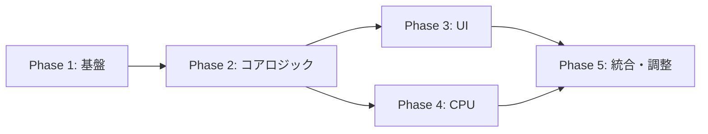

# 実装タスク一覧（Tasks）

> 固定順デッキ型TCG ブラウザプロトタイプ
> 世界観：星典×星霊（暫定）

---

## タスク管理ルール
- `[ ]` 未着手
- `[/]` 作業中
- `[x]` 完了
- 各タスクは上から順に実施（依存関係順）
- Phase内は並行可能だが、Phase間は順番を守る

---

## Phase 1: プロジェクト基盤（見積: 1〜2h）✅ 完了

### 1.1 プロジェクトセットアップ
- [x] `index.html` の作成（基本構造、meta、CSS/JS読み込み）
- [x] `css/style.css` の作成（リセットCSS、基本レイアウト）
- [x] `js/` ディレクトリ作成、各モジュールファイルの空ファイル作成
  - `main.js`, `game.js`, `card.js`, `player.js`, `battle.js`, `cpu.js`, `ui.js`, `logger.js`

### 1.2 カードデータ定義（`card.js`）
- [x] 属性定義（火・水・風・地）
- [x] 星霊カード 5種の定義
  - 火狐（火）/ 蒼騎士（水）/ 風読み（風）/ 岩守（地）/ 煌竜（火）
  - 各: 名前、コスト、星力値、属性
- [x] 攻星術カード 5種の定義
  - 火炎星（火）/ 氷瀑星（水）/ 烈風星（風）/ 震撃星（地）/ 流星撃（火）
  - 各: コスト、星力上昇値、ダメージ値、属性
- [x] 守星術カード 3種の定義
  - 水鏡盾（水）/ 風障壁（風）/ 岩盤陣（地）
  - 各: コスト、星力上昇値、属性
- [x] 星命カード 3種の定義
  - 星辰回帰 / 星霊鼓舞 / 星力充填
- [x] プリセット星典関数
  - [x] `getPlayerChronicle()` — プレイヤー用20ページ星典
  - [x] `getCpuChronicle()` — CPU用20ページ星典
  - [x] 1ページ目は必ず星霊カード
- [x] 共鳴判定関数 `hasResonance(astral, spell)`

### 1.3 動作確認
- [x] ブラウザで `index.html` を開き、エラーなく読み込めることを確認
- [x] `console.log` でカードデータ・星典構成が正しく出力されることを確認
- [x] 共鳴判定が正しく動作することを確認

---

## Phase 2: コアゲームロジック（見積: 4〜6h）✅ 完了

### 2.1 プレイヤー管理（`player.js`）
- [x] `createPlayer(id, chroniclePages)` — プレイヤー初期化
- [x] `readPage(player)` — 星典1ページ詠み + SP+2獲得
- [x] `canRead(player)` — 詠めるかの判定
- [x] `getRemainingPages(player)` — 残りページ数取得
- [x] `getSkyWindow(player)` — 現在の天窓カード取得（直近2枚）
- [x] `spendSP(player, cost)` — SP消費
- [x] `addSP(player, amount)` — SP追加
- [x] `summonAstral(player, card)` — 星霊を場に召喚
- [x] `removeAstral(player, index)` — 星霊を場から除去
- [x] `eclipseAstral(astral)` — 星霊を蝕態に
- [x] `isDefeated(player)` — 敗北判定（星典0 and 場に星霊なし）

### 2.2 戦闘ロジック（`battle.js`）
- [x] 共鳴システム
  - [x] `hasResonance(astral, spell)` — 属性一致判定
  - [x] `getResonanceBonus(astral, spell)` — ボーナス値取得（+1）
- [x] 過詠システム
  - [x] `getMaxOvercharge(spellCost)` — 過詠上限計算
  - [x] `calcOverchargeDamageBonus(extraSP)` — 追加ダメージ計算
  - [x] `calcOverchargePowerBonus(extraSP)` — 追加星力計算
- [x] 星力衝突
  - [x] `calcAttackPower(astral, spell, overcharge)` — 攻撃側合計星力
  - [x] `calcDefensePower(astral, spell, overcharge)` — 防御側合計星力
  - [x] `resolveClash(attackPower, defensePower)` — 攻撃成否判定
- [x] ダメージ解決
  - [x] `applyChronicleDamage(defender, damage)` — 星典めくりダメージ
  - [x] `guardWithAstral(astral)` — 星護処理
    - [x] 輝態→蝕態の状態遷移
    - [x] 蝕態→消星（除去）の処理
- [x] ユーティリティ
  - [x] `getAvailableAttackSpells(skyWindow, sp)` — 使用可能攻星術
  - [x] `getAvailableDefenseSpells(skyWindow, sp)` — 使用可能守星術

### 2.3 ゲームフロー（`game.js`）
- [x] `initGame()` — ゲーム全体初期化
  - [x] 星典セット
  - [x] 1ページ目星霊を場に召喚
  - [x] 初期詠み（1ページ）→ SP+2
- [x] スタートフェイズ
  - [x] `startPhase(state)` — フェイズ開始
  - [x] `playerReadPage(state)` — 詠み処理（0〜3回）
- [x] メインフェイズ
  - [x] `mainPhase(state)` — フェイズ移行
  - [x] `playerPlayCard(state, cardIndex)` — カードプレイ
    - [x] 星霊カード：場に召喚
    - [x] 星命カード：効果発動（1ターン1枚制限）
- [x] バトルフェイズ
  - [x] `battlePhase(state)` — フェイズ移行
  - [x] `playerStarStrike(state, astralIndex)` — 星撃宣言
  - [x] `playerSelectAttackSpell(state, spellIndex, overcharge)` — 攻星術+過詠選択
  - [x] 防御リアクションの処理
  - [x] 星力衝突の実行（共鳴・過詠反映）
  - [x] ダメージ解決（星護 or 星典めくり）
- [x] エンドフェイズ
  - [x] `endPhase(state)` — 場の整理
  - [x] 自動1ページ詠み（SP+2）
  - [x] 勝敗判定
- [x] `endTurn(state)` — ターン交代

### 2.4 ログ管理（`logger.js`）
- [x] `addLog(state, message)` — ログ追加
- [x] 各イベント用フォーマッター
  - [x] 詠みログ
  - [x] 星力衝突ログ（共鳴・過詠の反映表示）
  - [x] ダメージログ（星典 or 星護）
  - [x] 星霊召喚ログ
  - [x] 星術使用ログ

### 2.5 コアロジックのテスト
- [x] コンソールでターン進行をシミュレーション
- [x] 星力衝突が正しく判定されること（共鳴・過詠込み）
- [x] 星護システムが正しく動作すること（輝態→蝕態→消星）
- [x] 星典詠みでSPが正しく獲得されること
- [x] エッジケースの確認
  - [x] 星典が0になった時の敗北判定
  - [x] 場に星霊なし＋星霊カードなしの敗北判定
  - [x] フィールド上限（3体）到達時の処理
  - [x] 過詠上限の検証

---

## Phase 3: UI実装（見積: 4〜5h）✅ 完了

### 3.1 HTMLレイアウト
- [x] ゲーム画面全体のHTML構造
  - [x] CPU情報エリア（星典残り、SP）
  - [x] CPUフィールドエリア（星霊の輝態/蝕態表示）
  - [x] 星撃ゾーン（星力衝突のビジュアル）
  - [x] プレイヤーフィールドエリア
  - [x] プレイヤー情報エリア（星典残り、SP）
  - [x] 天窓カードエリア
  - [x] 操作パネル（詠みボタン、星撃宣言、ターンエンド）
  - [x] ログエリア
  - [x] 星典プレビューエリア

### 3.2 CSSスタイリング
- [x] 全体レイアウト
- [x] カードのビジュアル
  - [x] 星霊カード（属性色、星力値表示、輝態/蝕態の視覚表現）
  - [x] 攻星術カード（「攻⚔️」マーク、属性色、コスト、星力上昇値、ダメージ値）
  - [x] 守星術カード（「防🛡」マーク、属性色、コスト、星力上昇値）
  - [x] 星命カード
  - [x] ホバー・選択エフェクト
  - [x] 使用不可状態のグレーアウト
  - [x] 共鳴時の発光エフェクト
- [x] 属性カラーの定義（火=赤、水=青、風=緑、地=茶）
- [x] 星典残りの星型プログレスバー
- [x] フィールドの星霊状態表示（輝態=輝き、蝕態=暗い）
- [x] 星力衝突の演出エリア
- [x] 過詠UI（スライダー or ボタン）
- [x] ログエリアのスタイル

### 3.3 UI描画（`ui.js`）
- [x] `renderGameState(state)` — 画面全体の再描画
- [x] `renderChronicle(player, isSelf)` — 星典残り表示
- [x] `renderField(playerField, cpuField)` — フィールド表示
- [x] `renderSkyWindow(cards, sp)` — 天窓カード表示
- [x] `renderStatus(player, cpu)` — ステータス表示
- [x] `renderLog(messages)` — ログ表示
- [x] `renderBattlePhase(battleState)` — バトル中UI
- [x] `renderDamageChoice(damage)` — 星護選択UI
- [x] `renderChroniclePreview(pages, currentIndex)` — 星典プレビュー
- [x] `renderOverchargeUI(spell, sp)` — 過詠選択UI

### 3.4 フェイズ別UI切り替え
- [x] スタートフェイズUI（詠みボタン + 残回数表示）
- [x] メインフェイズUI（カード使用可能状態）
- [x] バトルフェイズUI
  - [x] 星撃宣言選択（攻撃する星霊選択）
  - [x] 攻星術選択 + 過詠UI
  - [x] 防御リアクションUI（守星術 or パス + 過詠）
  - [x] 星力衝突結果の演出（共鳴発動表示含む）
  - [x] 星護 / 星典ダメージの選択UI

### 3.5 イベントハンドリング
- [x] 詠みボタンクリック → ページ詠み
- [x] 天窓カードクリック → カードプレイ
- [x] フィールド星霊クリック → 星撃宣言 or 星護選択
- [x] 星撃宣言ボタン → 戦闘開始
- [x] 過詠UI操作 → 追加SP設定
- [x] ターンエンドボタン → ターン終了
- [x] 星典ダメージ受けるボタン → ダメージ解決

### 3.6 UI動作確認
- [x] 星典の詠みが画面に正しく反映されること
- [x] 天窓カードが更新されること
- [x] 星霊の輝態/蝕態が視覚的に区別できること
- [x] 属性色が正しく表示されること
- [x] 共鳴発生時のビジュアルフィードバック
- [x] 過詠UIが正しく機能すること
- [x] 星力衝突の結果が分かりやすく表示されること

---

## Phase 4: CPU実装（見積: 3〜4h）✅ 完了

### 4.1 CPU行動ロジック（`cpu.js`）
- [x] `cpuStartPhase(state)` — 詠み枚数決定
  - [x] 残りページとSP残量に基づく判断
- [x] `cpuMainPhase(state)` — カード使用判断
  - [x] 星霊不在時の最優先召喚
  - [x] 星命カードの使用判断
- [x] `cpuBattlePhase(state)` — 攻撃判断
  - [x] 攻撃する星霊と攻星術の選択
  - [x] 共鳴する組み合わせを優先選択
  - [x] 過詠の使用判断（SPに余裕があれば）
- [x] `cpuDefenseReaction(state, attackPower)` — 防御リアクション
  - [x] 守星術で防げるか判断（共鳴・過詠込み）
  - [x] 防御不可時のパス
- [x] `cpuGuardDecision(state, damage)` — 星護判断
  - [x] 星典残りと星霊状態の比較

### 4.2 CPUのUI統合
- [x] CPU行動時の待機演出（遅延表示で「考えている」感）
- [x] CPUの各フェイズ行動をログ表示
- [x] CPUの防御リアクション / 星護判断のUI反映
- [x] CPU行動後の画面更新

### 4.3 CPU動作確認
- [x] CPUが毎ターン適切に詠み判断すること
- [x] CPUがSP不足のカードを使わないこと
- [x] CPUが共鳴する組み合わせを優先すること
- [x] CPUの星力衝突が正しく処理されること
- [x] CPUの星護判断が合理的であること

---

## Phase 5: 統合・調整（見積: 2〜3h）✅ 完了

### 5.1 エントリーポイント（`main.js`）
- [x] ゲーム初期化処理
- [x] ゲーム開始ボタンの実装
- [x] UIとロジックの結合

### 5.2 通しプレイテスト
- [x] 1試合を最初から最後までプレイ
- [x] 以下の項目を確認：
  - [x] ゲーム開始 → 1ページ目星霊召喚 → 初期SP+2
  - [x] スタートフェイズの詠みが0〜3ページで正しく動作
  - [x] SPが星典詠みで正しく増加
  - [x] 星霊の場への召喚が正常
  - [x] 星力衝突が正しく判定（共鳴ボーナス含む）
  - [x] 過詠が正しく機能する
  - [x] 攻撃成功時のダメージ（星典めくり）が正しい
  - [x] 星護システムが正しく動作
  - [x] CPUの攻撃・防御が正常
  - [x] 勝利条件（星典消滅 or 星霊全滅）が正しく判定
  - [x] エンドフェイズの自動1ページ詠みが正しい

### 5.3 バグ修正
- [x] 通しプレイで発見されたバグの修正
- [x] エッジケースの修正

### 5.4 バランス調整
- [x] カードの星力値・コスト調整レビュー（今回は現行値維持）
- [x] 星術のダメージ値・星力上昇値調整レビュー（今回は現行値維持）
- [x] 星典ページ数の調整レビュー（今回は現行値維持）
- [x] 共鳴ボーナスの調整レビュー（今回は現行値維持）
- [x] 過詠のコスパ調整レビュー（今回は現行値維持）
- [x] CPUの行動パターン調整

### 5.5 最終確認
- [x] Chrome で動作確認
- [x] Firefox で動作確認
- [x] Safari相当のWebKit で動作確認
- [x] コンソールにエラーが出ないことを確認

---

## タスク依存関係

---

## 見積サマリー

| Phase | 内容 | 見積 | 主要成果物 |
|-------|------|------|------------|
| Phase 1 | プロジェクト基盤 | 1〜2h | ファイル構成、カード/星典データ |
| Phase 2 | コアロジック | 4〜6h | 星力衝突・共鳴・過詠・星護含むゲームエンジン |
| Phase 3 | UI実装 | 4〜5h | フェイズ別操作UI、属性色、過詠UI |
| Phase 4 | CPU実装 | 3〜4h | 共鳴活用・防御・星護のAI |
| Phase 5 | 統合・調整 | 2〜3h | 完成プロトタイプ |
| **合計** | | **14〜20h** | |
